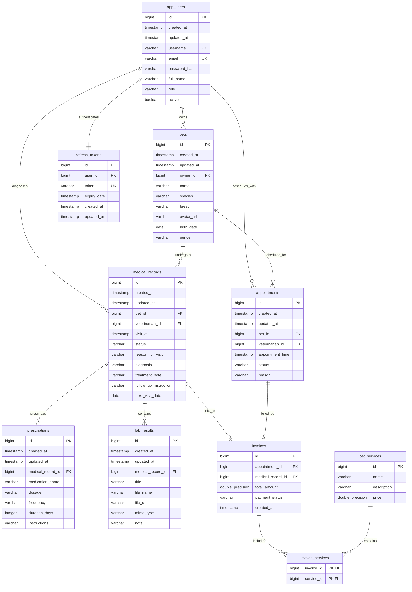

# 🐾 PetCare Database Entity-Relationship Diagram (ERD)

This document contains the ERD and relationships for the PetCare database schema.

---

## 📊 Database Schema Relationships

Below is the Mermaid diagram representing all entities and their relations.

---

## 🗄️ Primary Relationships

1. **User Auths**:
   - `app_users` table holds user details for all roles (OWNER, VET, ADMIN).
   - `refresh_tokens` is a 1-to-1 table containing token rotation IDs linked directly to `app_users`.
2. **Owners & Pets**:
   - One user (role `OWNER`) can own multiple `pets`. (1-to-Many).
3. **Visits & Clinic Workflows**:
   - One pet undergoes multiple `medical_records` (clinic visits).
   - One medical record can contain multiple `prescriptions` and `lab_results`.
4. **Appointments & Billing**:
   - Owners schedule `appointments` for their pets.
   - An appointment can result in an `invoice` containing multiple selected `pet_services`.
